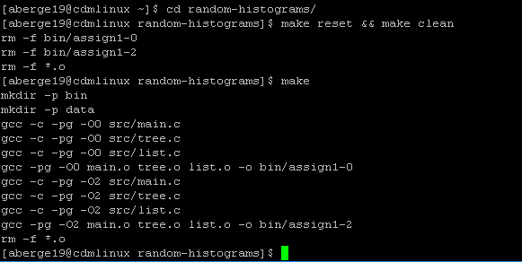
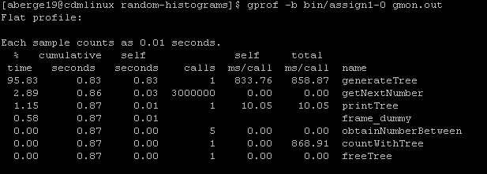
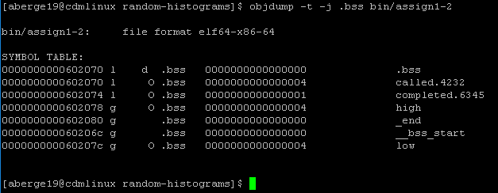
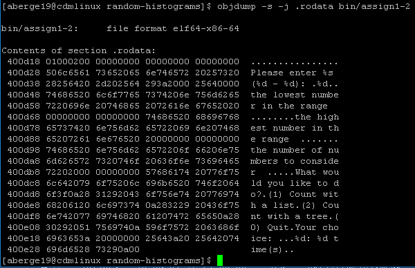

***

##### Andrew Berger  |   CSC407 - Systems II  |   Winter 2018   |   2/4/2018  |   Joseph Phillips  |   


### assign1




***


> __Run assign1-0 twice timing it both times, and answer the following:__

1. __How for 3 million numbers how many self seconds did generateList() take assign1-0?__

```
%   cumulative   self              self     total           
time   seconds   seconds    calls   s/call   s/call  name    
100.45    267.01   267.01        1   267.01   267.01  generateList
```

2. __How for 3 million numbers how many self seconds did generateTree() take for assign1-0?__


```
%   cumulative   self              self     total           
time   seconds   seconds    calls  ms/call  ms/call  name    
87.50      0.70     0.70        1   700.00   720.00  generateTree
```

> __Run assign1-2 twice timing it both times, and answer the following:__

3. __How for 3 million numbers how many self seconds did generateList() take for assign1-2?__

```
%   cumulative   self              self     total           
time   seconds   seconds    calls   s/call   s/call  name    
99.87    246.70   246.70        1   246.70   246.75  generateList
```

4. __How for 3 million numbers how many self seconds did generateTree() take for assign1-2?__

```
%   cumulative   self              self     total           
time   seconds   seconds    calls  ms/call  ms/call  name    
88.68      0.47     0.47        1   470.00   490.00  generateTree
```

***
> __Please find the following inside of assign1-0 by using objdump.__
-  A) __Integer entry in obtainNumberBetween__
-  B) __The string "What would you like to do?\n..." in main()__
-  C) __The code for getNextNumber()__
-  D) __The global variable low__

 Question | Command                                     | Results | Comment                                                 
----------|---------------------------------------------|---------|---------------------------------------------------------
 __A__    | ```objdump -t -j .bss bin/assign1-0```     | N       | Integer entry in obtainNumberBetween lives on the stack 
 __B__    | ```objdump -s -j .rodata bin/assign1-0```   | Y       | Constants are in the .rodata section                                                        
 __C__    | ```objdump -d -j .text bin/assign1-0```     | Y       | Code is stored in the .text section                                                         
 __D__    | ```objdump -t -j .bss bin/assign1-0 ```     | Y       | Uninitialized variables are in .bss                                                        

### Optimizations from the Compiler

-  __getNextNumber__ has a reduction in the number of memory lookups when switching the compiler flag from -O0 to -O2. 
  Variables are kept in registers versus RAM (the stack) for performance. Instead of using ```lea```  to compute the
  addresses of high and low from the instruction pointer the optimized code uses ```mov```  to read the values directly into registers.

> objdump -d bin/assign1-0 # without optimzation (objdump-assign1-0.txt)

```

  401585:	48 8d 05 44 74 00 00 	lea    0x7444(%rip),%rax        # 4089d0 <high>
  40158c:	8b 10                	mov    (%rax),%edx
  40158e:	48 8d 05 3f 74 00 00 	lea    0x743f(%rip),%rax        # 4089d4 <low>
  401595:	8b 00                	mov    (%rax),%eax
  401597:	29 c2                	sub    %eax,%edx
  401599:	89 d0                	mov    %edx,%eax
  40159b:	8d 48 01             	lea    0x1(%rax),%ecx
  40159e:	44 89 c0             	mov    %r8d,%eax
  4015a1:	99                   	cltd   
```

> objdump -d bin/assign1-2 # (objdump-assign1-2.txt)

```

  40157e:	44 8b 05 4f 74 00 00 	mov    0x744f(%rip),%r8d        # 4089d4 <low>
  401585:	8b 0d 45 74 00 00    	mov    0x7445(%rip),%ecx        # 4089d0 <high>
  40158b:	99                   	cltd   
  40158c:	44 29 c1             	sub    %r8d,%ecx
  40158f:	83 c1 01             	add    $0x1,%ecx
```

-  __main__ has an optimization in calls to obtainNumberBetween. When setting
  ```%edx``` before the call, the optimzed code does a ```xor   %edx,%edx``` to 
  set the parameter to zero instead of a ```mov     $0x0,%edx```. There are less
  memory lookups in the optimized code (2 vs. 3) in the first 11 lines of main

> objdump -d bin/assign1-0 # without optimization (objdump-assign1-0.txt)

```
000000000040162e <main>:
  40162e:	e8 b2 20 00 00       	callq  4036e5 <__fentry__>
  401633:	55                   	push   %rbp
  401634:	48 89 e5             	mov    %rsp,%rbp
  401637:	48 83 ec 50          	sub    $0x50,%rsp
  40163b:	e8 c0 28 00 00       	callq  403f00 <_monstartup>
  401640:	e8 db 06 00 00       	callq  401d20 <__main>
  401645:	48 8d 05 d4 39 00 00 	lea    0x39d4(%rip),%rax        # 405020 <.rdata+0x20>
  40164c:	48 89 45 f0          	mov    %rax,-0x10(%rbp)
  401650:	48 8b 45 f0          	mov    -0x10(%rbp),%rax
  401654:	41 b8 ff 7f 00 00    	mov    $0x7fff,%r8d
  40165a:	ba 00 00 00 00       	mov    $0x0,%edx
  40165f:	48 89 c1             	mov    %rax,%rcx
  401662:	e8 4e ff ff ff       	callq  4015b5 <obtainNumberBetween>
```

> objdump -d bin/assign1-2 # (objdump-assign1-2.txt)

```
0000000000403de0 <main>:
  403de0:	e8 a0 f7 ff ff       	callq  403585 <__fentry__>
  403de5:	56                   	push   %rsi
  403de6:	53                   	push   %rbx
  403de7:	48 83 ec 28          	sub    $0x28,%rsp
  403deb:	48 8d 1d a6 12 00 00 	lea    0x12a6(%rip),%rbx        # 405098 <.rdata+0x98>
  403df2:	e8 a9 ff ff ff       	callq  403da0 <_monstartup>
  403df7:	e8 c4 dd ff ff       	callq  401bc0 <__main>
  403dfc:	41 b8 ff 7f 00 00    	mov    $0x7fff,%r8d
  403e02:	31 d2                	xor    %edx,%edx
  403e04:	48 8d 0d 15 12 00 00 	lea    0x1215(%rip),%rcx        # 405020 <.rdata+0x20>
  403e0b:	e8 90 d7 ff ff       	callq  4015a0 <obtainNumberBetween>
```

***

### Action Screenshots



***



***



***
